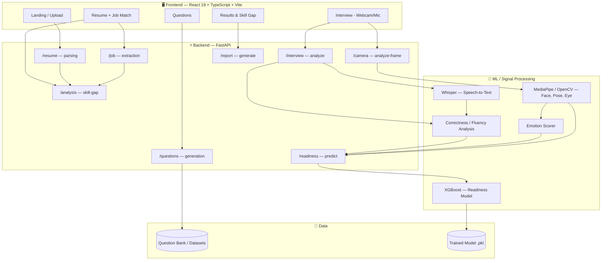
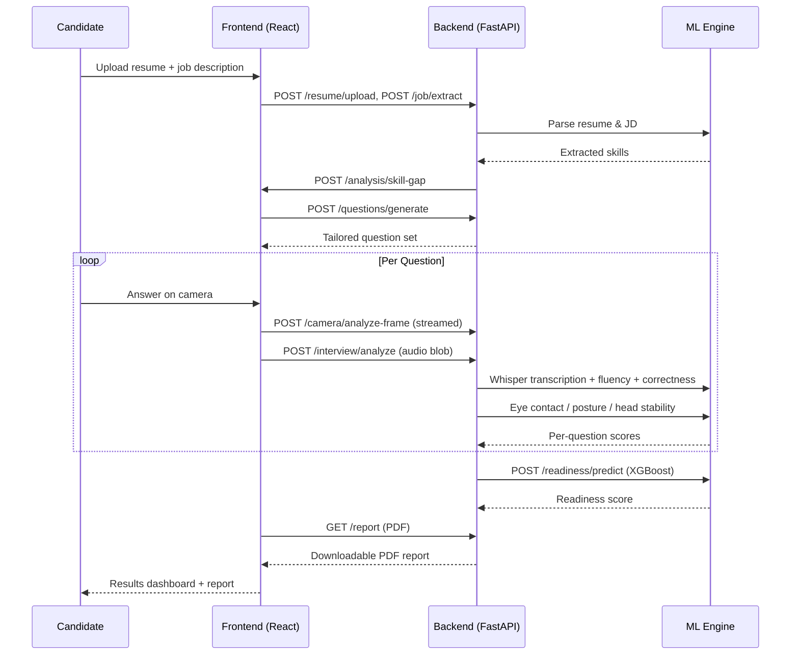

<div align="center">


<br/>

[](https://interview-readiness-analyzer-tau.vercel.app)
[](LICENSE)
[](#)
[](#)
[](#)
[](#)


</div>

---

## 📑 Table of Contents

- [🚀 Overview](#-overview)
- [✨ Features](#-features)
- [🏗️ Architecture](#️-architecture)
- [🔄 Workflow](#-workflow)
- [🛠️ Tech Stack](#️-tech-stack)
- [📂 Project Structure](#-project-structure)
- [⚙️ Installation](#️-installation)
- [🔑 Environment Variables](#-environment-variables)
- [🌐 Deployment](#-deployment)
- [📡 API Endpoints](#-api-endpoints)
- [🧠 Machine Learning Pipeline](#-machine-learning-pipeline)
- [👀 Camera Analysis](#-camera-analysis)
- [🎤 Speech Analysis](#-speech-analysis)
- [📊 Readiness Prediction](#-readiness-prediction)
- [📄 PDF Report](#-pdf-report)
- [📸 Screenshots](#-screenshots)
- [🚀 Future Improvements](#-future-improvements)
- [👨‍💻 Developer](#-developer)
- [📜 License](#-license)
- [⭐ Support](#-support)

---

## 🚀 Overview

**AI Interview Readiness Analyzer** is a full-stack, ML-powered platform that runs a candidate through a realistic mock interview and scores how "ready" they actually are — not just what they said, but *how* they said it and *how* they carried themselves while saying it.

It combines **speech transcription (Whisper)**, **computer-vision behavioral analysis (MediaPipe + OpenCV)**, **NLP-based answer correctness scoring**, and an **XGBoost readiness model** into a single automated pipeline: upload a resume and job description → get tailored questions → answer them on camera → receive a data-backed readiness score and a downloadable PDF report.

> 🔗 **Live app:** [interview-readiness-analyzer-tau.vercel.app](https://interview-readiness-analyzer-tau.vercel.app)

---

## ✨ Features

- 📄 **Resume + Job Description parsing** — extracts skills and context from an uploaded resume (PDF) and a target job description
- 🎯 **Skill-gap analysis** — compares resume skills against the job description to surface gaps
- ❓ **Dynamic question generation** — generates a tailored bank of interview questions based on role and skill gaps
- 🎥 **Fully automated interview flow** — a phase-based state machine (`loading → interviewing → analyzing → complete`) records webcam + mic per question with no manual controls
- 🗣️ **Speech-to-text & fluency scoring** — Whisper-based transcription with filler-word detection, pace, and fluency analysis
- ✅ **Answer correctness scoring** — NLP-based comparison against ideal/expected answers
- 👁️ **Eye contact, posture & head stability tracking** — real-time frame-by-frame computer-vision scoring via MediaPipe
- 🙂 **Emotion detection** — facial emotion scoring during responses
- 📊 **ML-driven readiness score** — an XGBoost regression model fuses fluency, correctness, eye contact, posture, and head stability into a single readiness score
- 📄 **Auto-generated PDF report** — a downloadable, shareable report summarizing performance and readiness
- 🐳 **Dockerized services** — separate backend and frontend containers orchestrated via `docker-compose`

---

## 🏗️ Architecture




**Design highlights:**
- Backend and frontend are decoupled services communicating over REST, each independently containerized.
- A single `MediaStream` is reused across the interview session, with a separate `MediaRecorder` instance spun up per question to keep audio segments isolated.
- Camera frames are streamed to `/camera/analyze-frame` for near real-time eye contact, posture, and head stability scoring.
- All per-question analyses (speech + video) run **sequentially** on the backend to avoid overloading ML inference under load.

---

## 🔄 Workflow



**State machine (`Interview.tsx`):**

```
loading → interviewing → analyzing → complete
```

Each phase transition is guarded to survive React 18 Strict Mode double-invocation, and audio blobs are held in a `ref` (not React state) to avoid unnecessary re-renders during recording.

---

## 🛠️ Tech Stack

| Layer | Technologies |
|---|---|
| **Frontend** | React 19, TypeScript, Vite, Tailwind CSS 4, Framer Motion, React Router, Recharts, Axios, `react-webcam`, Lucide Icons |
| **Backend** | FastAPI, Uvicorn, Starlette, Pydantic, `python-multipart` |
| **Machine Learning** | XGBoost, scikit-learn, NumPy, pandas, SciPy, joblib |
| **Speech** | OpenAI Whisper (via `SpeechRecognition` / `pydub`) |
| **Computer Vision** | OpenCV, OpenCV-contrib, MediaPipe |
| **Document Processing** | `pdfplumber`, `reportlab`, `fpdf`, Pillow |
| **LLM / NLP Services** | Google Generative AI, Groq API |
| **Infra** | Docker, Docker Compose, Railway (backend), Vercel (frontend) |

---

## 📂 Project Structure

```
Interview_readiness_analyzer/
├── backend/
│   ├── api/
│   │   ├── main.py                 # FastAPI app + router registration
│   │   ├── routes/                 # resume, interview, report, prediction,
│   │   │                           # job, analysis, questions, camera, readiness
│   │   ├── schemas/                # Pydantic request/response models
│   │   └── services/               # interview, prediction, report, resume services
│   ├── interview/                  # Recording, transcription, scoring modules
│   │   ├── audio_recorder.py
│   │   ├── speech_to_text.py
│   │   ├── correctness_analysis.py
│   │   ├── fluency_analysis.py
│   │   ├── advanced_fluency.py
│   │   ├── eye_contact_analysis.py
│   │   ├── posture_analysis.py
│   │   ├── head_stability.py
│   │   ├── face_emotion.py / emotion_scorer.py
│   │   ├── feature_aggregator.py
│   │   ├── question_engine.py
│   │   ├── report_generator.py
│   │   └── mock_interview_engine.py
│   ├── ml/                         # Training & inference for the readiness model
│   │   ├── train_model.py / train_final_model.py
│   │   ├── tune_xgboost.py
│   │   ├── predict_readiness.py
│   │   ├── readiness_score.py
│   │   ├── generate_training_dataset.py
│   │   └── readiness_model.pkl
│   ├── services/                   # Resume/JD parsing, skill-gap, question generation
│   │   ├── resume_parser.py / pdf_parser.py
│   │   ├── job_parser.py
│   │   ├── skill_gap.py
│   │   ├── question_generator.py / online_question_generator.py
│   │   └── report_generator.py
│   ├── data_processing/            # Dataset cleaning & question bank building
│   └── models/                     # Serialized model artifacts
├── data/
│   ├── raw/                        # Source datasets (resumes, questions, JDs)
│   ├── processed/                  # Cleaned datasets
│   ├── training/                   # Model training scripts
│   └── resumes/
├── frontend/
│   ├── src/
│   │   ├── components/             # Camera, Hero, Navbar, UploadCard, etc.
│   │   ├── pages/                  # Landing, Dashboard, Interview, Questions,
│   │   │                           # Results, Resume, SkillGap
│   │   ├── services/               # Typed API clients (Axios)
│   │   └── router/                 # AppRouter.tsx
│   └── package.json
├── docker/
│   ├── Dockerfile.backend
│   └── Dockerfile.frontend
├── docker-compose.yml
├── requirements.txt
├── .env.example
└── LICENSE
```

---

## ⚙️ Installation

### Prerequisites
- Python 3.10+
- Node.js 18+
- Docker & Docker Compose *(optional, for containerized setup)*

### 1. Clone the repository
```bash
git clone https://github.com/Nikhildhuria01/Interview_readiness_analyzer.git
cd Interview_readiness_analyzer
```

### 2. Backend setup
```bash
python -m venv venv
source venv/bin/activate      # Windows: venv\Scripts\activate

pip install -r requirements.txt

cp .env.example .env          # then fill in your keys

cd backend
uvicorn api.main:app --reload --port 8000
```

### 3. Frontend setup
```bash
cd frontend
npm install
npm run dev
```

The frontend will be available at `http://localhost:5173` and the API at `http://localhost:8000`.

### 4. Or run everything with Docker Compose
```bash
docker-compose up --build
```
This spins up:
- `interview-backend` → `http://localhost:8000`
- `interview-frontend` → `http://localhost:5173`

---

## 🔑 Environment Variables

Create a `.env` file in the project root (see `.env.example`):

| Variable | Description |
|---|---|
| `GROQ_API_KEY` | API key for Groq-hosted LLM inference (question generation / answer evaluation) |

> 💡 If you extend the app to use Google's Generative AI SDK (already listed in `requirements.txt`), add a `GOOGLE_API_KEY` (or equivalent) as well.

---

## 🌐 Deployment

The project is deployed with a **split-hosting** strategy:

| Service | Platform | Notes |
|---|---|---|
| **Frontend** | [Vercel](https://vercel.com) | Static Vite build, auto-deployed from `main` |
| **Backend (FastAPI + ML)** | [Railway](https://railway.app) | Container built from `docker/Dockerfile.backend` |

### Deploying the backend to Railway
1. Push the repo to GitHub.
2. Create a new Railway project → **Deploy from GitHub repo**.
3. Set the build to use `docker/Dockerfile.backend`.
4. Add environment variables (`GROQ_API_KEY`, etc.) in the Railway dashboard.
5. Expose port `8000` and copy the generated public URL.

> ⚠️ For a lean production image, prefer a **CPU-only PyTorch build**, download Whisper model weights **at runtime** rather than baking them into the image, and use a **multi-stage Docker build** to strip build-time dependencies (compilers, headers) from the final image.

### Deploying the frontend to Vercel
1. Import the repo into Vercel and set the **root directory** to `frontend`.
2. Framework preset: **Vite**.
3. Add an environment variable pointing the frontend's API client (`src/services/api.ts`) at your Railway backend URL.
4. Deploy — Vercel handles previews on every PR automatically.

**Live deployment:** [interview-readiness-analyzer-tau.vercel.app](https://interview-readiness-analyzer-tau.vercel.app)

---

## 📡 API Endpoints

All routes are served from the FastAPI app defined in `backend/api/main.py`.

| Method | Endpoint | Description |
|---|---|---|
| `GET` | `/` | Health check — API status & version |
| `POST` | `/resume/upload` | Upload a resume file |
| `POST` | `/resume/extract` | Extract structured data/skills from a resume |
| `POST` | `/job/extract` | Extract requirements/skills from a job description |
| `POST` | `/analysis/skill-gap` | Compare resume vs. job description for skill gaps |
| `POST` | `/questions/generate` | Generate a tailored interview question set |
| `GET` | `/interview/` | Fetch interview session/question data |
| `POST` | `/interview/analyze` | Analyze a recorded answer (audio → transcript → scores) |
| `POST` | `/interview/cleanup` | Clean up temporary session files |
| `POST` | `/camera/analyze-frame` | Analyze a single webcam frame (eye contact, posture, head stability) |
| `POST` | `/readiness/predict` | Run the XGBoost model to compute a readiness score |
| `GET` | `/prediction/` | Fetch prediction-related data |
| `GET` | `/report/` | Fetch report data/status |
| `POST` | `/report/generate` | Generate the final PDF report |

> 📘 Interactive Swagger docs are auto-generated by FastAPI at `/docs` on the running backend.

---

## 🧠 Machine Learning Pipeline

The readiness score is produced by a dedicated pipeline in `backend/ml/`:

1. **Feature aggregation** (`feature_aggregator.py`) — combines per-question fluency, correctness, eye contact, posture, and head stability into session-level features.
2. **Dataset generation** (`generate_training_dataset.py`, `dataset_generator.py`) — builds labeled training data from simulated/real interview sessions.
3. **Model training** (`train_model.py`, `train_final_model.py`, `tune_xgboost.py`) — trains and hyperparameter-tunes an **XGBoost regressor**.
4. **Evaluation** (`model_evaluation_report.py`, `residual_plot.py`, `actual_vs_predicted.py`, `feature_importance.py`) — validates model quality and explains feature contributions.
5. **Inference** (`predict_readiness.py`, `readiness_score.py`) — loads `readiness_model.pkl` and serves predictions via `/readiness/predict`.

---

## 👀 Camera Analysis

Powered by **MediaPipe** and **OpenCV**, running per-frame on the backend:

- **Eye contact scoring** (`eye_contact_analysis.py`) — tracks gaze direction relative to camera
- **Posture scoring** (`posture_analysis.py`) — tracks shoulder/spine alignment via pose landmarks
- **Head stability** (`head_stability.py`) — measures excessive head movement/fidgeting
- **Facial emotion detection** (`face_emotion.py`, `emotion_scorer.py`) — scores emotional expression during answers

A **cross-platform OpenMP deadlock** (triggered by MediaPipe, XGBoost, and PyTorch all loading `libomp.dylib` simultaneously on macOS) is mitigated with `KMP_DUPLICATE_LIB_OK=TRUE` and scoped thread-count caps set before any heavy imports.

---

## 🎤 Speech Analysis

- **Transcription** (`speech_to_text.py`) — Whisper-based, running on CPU with an explicit socket timeout to avoid silent hangs on model load
- **Fluency analysis** (`fluency_analysis.py`, `advanced_fluency.py`) — pace, filler words, pauses
- **Correctness analysis** (`correctness_analysis.py`) — compares transcribed answers against an ideal-answer generator (`ideal_answer_generator.py`)
- **Silence handling** — an RMS/VAD pre-transcription energy check plus a post-transcription `no_speech_prob` validation guards against Whisper hallucinating plausible-sounding text on silent audio

---

## 📊 Readiness Prediction

The final readiness score fuses all signals — **fluency**, **correctness**, **eye contact**, **posture**, and **head stability** — into a single XGBoost prediction, exposed via:

```http
POST /readiness/predict
Content-Type: application/json

{
  "fluency": 0.82,
  "correctness": 0.75,
  "eye_contact": 0.68,
  "posture": 0.91,
  "head_stability": 0.88
}
```

---

## 📄 PDF Report

At the end of a session, `report_generator.py` (backend `interview/` and `services/`) compiles all scores, transcripts, and feedback into a downloadable **PDF report** (built with `reportlab`/`fpdf`), served via `GET /report/` and `POST /report/generate`.

---

## 📸 Screenshots

> Add product screenshots or a short demo GIF here to showcase the Landing page, live Interview screen, and Results dashboard.

<div align="center">

| Landing | Interview | Results |
|---|---|---|
| _add screenshot_ | _add screenshot_ | _add screenshot_ |

</div>

---

## 🚀 Future Improvements

- [ ] Real-time streaming feedback during the interview (rather than post-hoc analysis)
- [ ] Multi-language support for transcription and question generation
- [ ] User authentication and historical readiness-score tracking
- [ ] Slimmer production Docker images (CPU-only PyTorch wheels, runtime model downloads, multi-stage builds)
- [ ] Configurable interview difficulty and role-specific question banks
- [ ] WebSocket-based camera analysis instead of per-frame REST calls
- [ ] Unit/integration test coverage expansion (CI pipeline)

---

## 👨‍💻 Developer

**Nikhil Dhuria**

[](https://github.com/Nikhildhuria01)

---

## 📜 License

This project is licensed under the **MIT License** — see the [LICENSE](LICENSE) file for details.

---

## ⭐ Support

If this project helped you or you found it interesting, consider giving it a **star** — it genuinely helps!

<div align="center">

[](https://star-history.com/#Nikhildhuria01/Interview_readiness_analyzer&Date)

</div>

<div align="center">


</div>